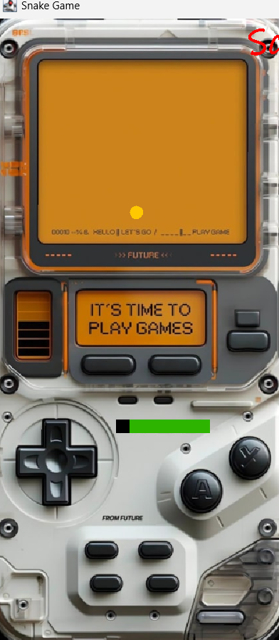

# Snake Game

# Overview

This project is a classic Snake game implemented in Java using the Swing library for the graphical user interface. The game features a snake that moves around the screen, eating apples to grow in length. The objective is to eat as many apples as possible without colliding with the walls or the snake's own body.

# Features

Responsive Controls: Control the snake using the arrow keys.
Score Tracking: Displays the current and previous scores.
Restart Button: Allows the player to restart the game after a game over.
Background Image: Customizable background image for the game screen.

# Gameplay Instructions

- Starting the Game: The game starts with a snake of 6 body parts. Use the arrow keys to control the direction of the snake.

- Eating Apples: Move the snake to eat the apples that appear on the screen. Each apple eaten increases the snake's length and the score.

- Avoid Collisions: Do not let the snake collide with the walls or its own body, as this will end the game.

- Restarting the Game: After a game over, click the "Restart" button to start a new game.

# Code Overview
- GamePanel.java: The main game panel that handles the game logic, rendering, and user input.

- SCREEN_WIDTH and SCREEN_HEIGHT: Dimensions of the game screen.

- UNIT_SIZE: Size of each unit (snake and apple).

- initGame(): Initializes the game state and starts the timer.

- newApple(): Generates a new apple at a random position.

- move(): Moves the snake in the current direction.

- checkApple(): Checks if the snake has eaten an apple.

- checkCollisions(): Checks for collisions with walls or the snake's body.

- gameOver(): Displays the game over screen and the previous score.

- MyKeyAdapter: Handles keyboard input for controlling the snake.

# Project Images

License

This project is licensed under the MIT License - see the LICENSE file for details.
